# Supporting System for Recording the Number of COVID Cases

## Project Overview

This project is an information system designed for managing data related to COVID tests and patient treatment. The system enables users to perform a wide range of operations concerning this data. Users can log in to their accounts, log out, change their passwords, and view their account details. It also provides a help feature for user assistance.

**This repository is about the client application! The server application is available here: [SSC](https://github.com/kkmp/SSC).**
  
## Functionalities

- **Account Management:**
  - Log in to the account
  - Log out of the account
  - Change login password
  - View personal account details
  - Display user help

- **COVID Test and Patient Data Management:**
  - Enter, edit, and view data on COVID tests
  - Add, edit, and view patient treatment information
  - Enter, edit, search, view, sort, and filter patient data
  - View recently added patients

- **Reporting and Data Export:**
  - Generate reports based on various parameters:
    - Time period
    - Location
    - Test type
    - Test result
    - Treatment status
    - Complications
  - Export data to CSV or XLSX files

- **Administrative Functions:**
  - Create and deactivate user accounts
  - Search, view, sort, and filter user data
  - Edit user account details

## Technologies Used

- **Server-side Technologies:**
  - C#
  - ASP.NET Core 6
  - Additional libraries: AutoMapper, Epplus, MailKit

- **Client-side Technologies:**
  - JavaScript
  - React.js (version 18.2.0)
  - HTML5
  - CSS
  - MUI (Material-UI)
  - Bootstrap (version 5.1)
  - Axios

- **Database:**
  - MySQL
  - Entity Framework Core 6

## Example Screenshots

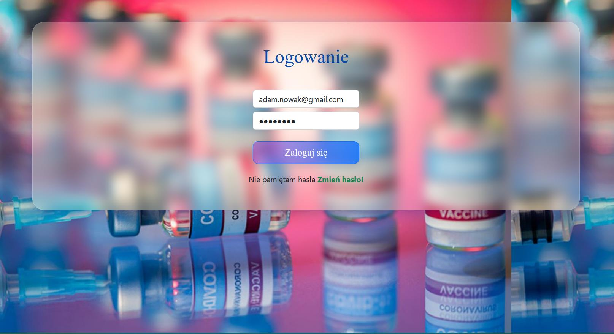  
   *Login Form*

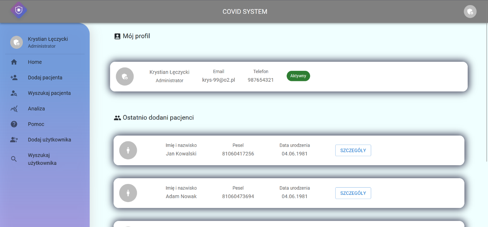  
   *Home Page After Login*

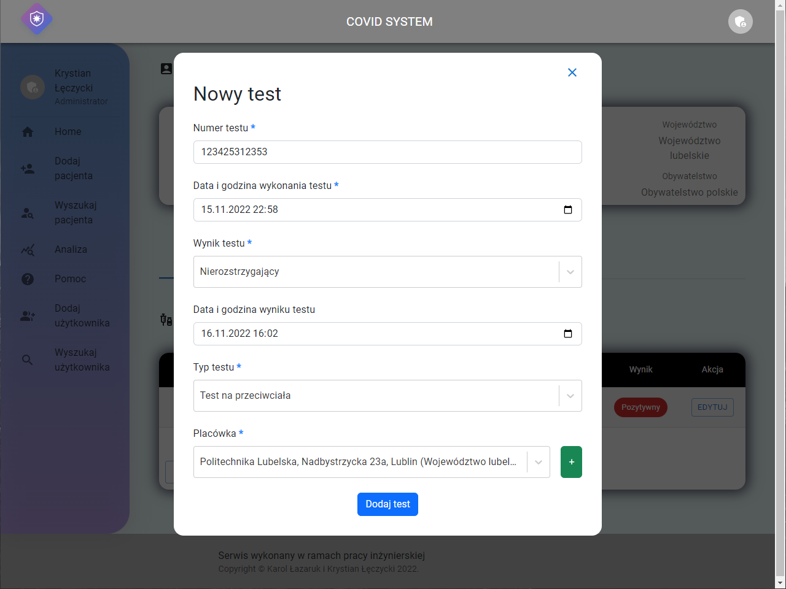  
   *Add New Test Form*

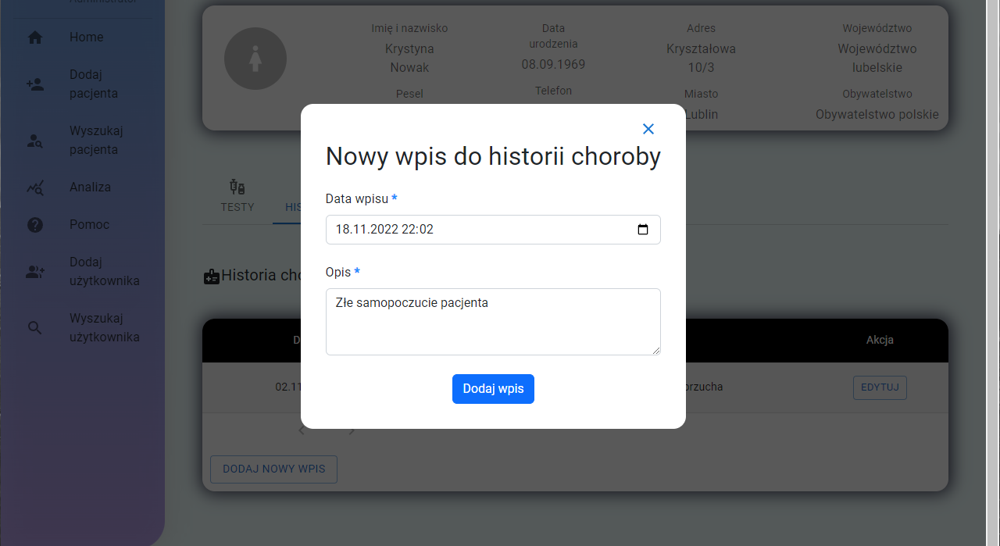  
   *Add New Disease History Entry Form*

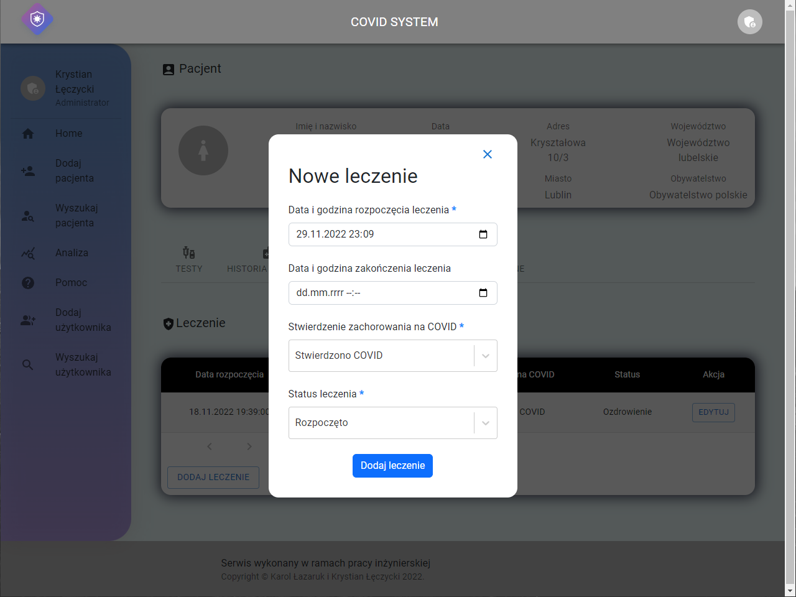  
   *Add New Treatment Entry Form*

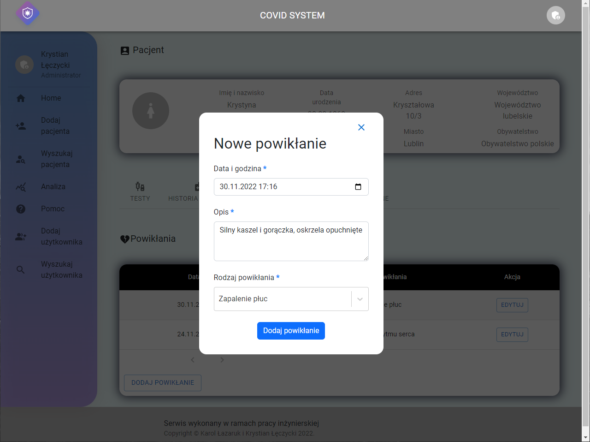  
   *Add New Complication Entry Form*

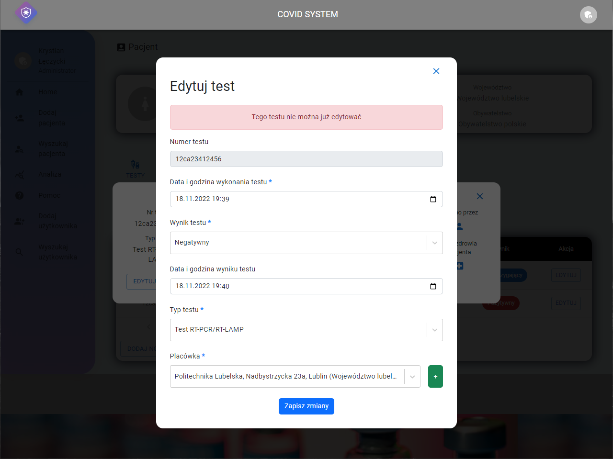  
   *Edit Test Unavailable Message*

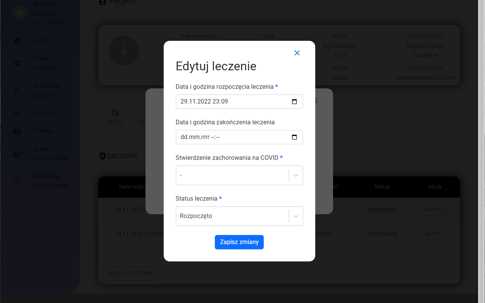  
   *Edit Treatment Entry Form*

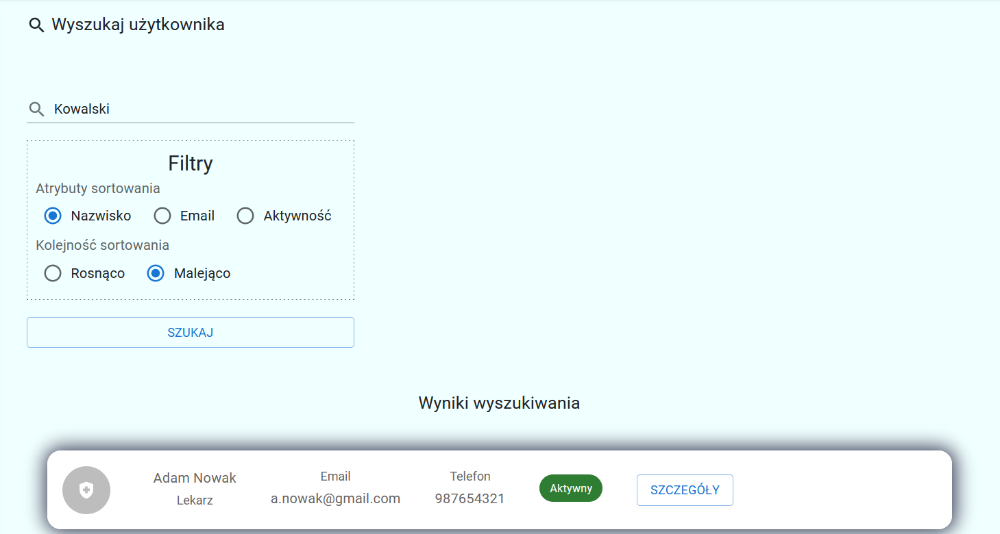  
   *User Data Search Results*

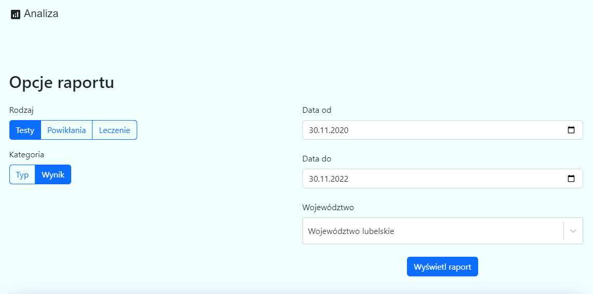  
    *Report Module Analysis Options*

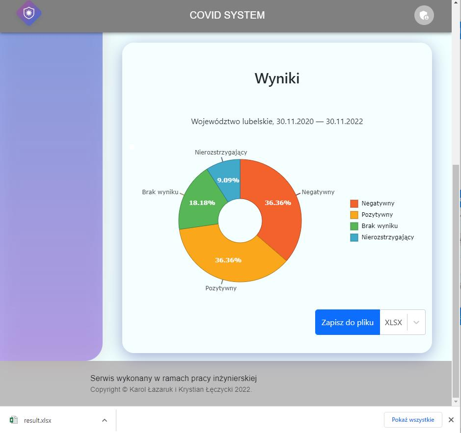  
    *Generated Report for Specified Data*

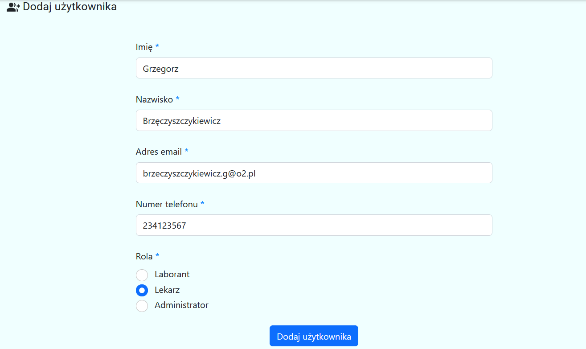  
    *Add New User Form*
